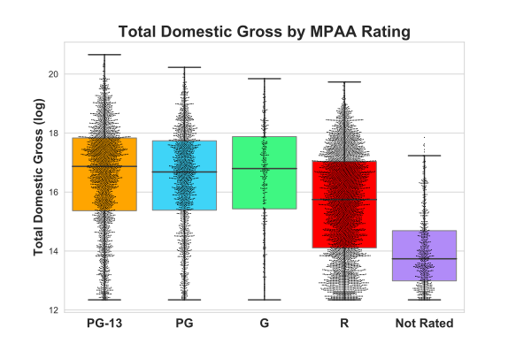

## Metis Project: Scraping, Cleaning, and Analyzing Data with Regression

### Tools: Python (sklearn, statsmodels, pandas, numpy, matplotlib, seaborn), BeautifulSoup (web scraping), and regular expressions (re). 

**I love movies so for this web-scraping project I scraped some movie data from IMDb. My main goal was to build a regression model that predicts total domestic gross only using information that could be known before a movie is released in theaters. The first step was checking out IMDb and figuring out an effective approach to scrape data. I decided to use the feature film “sort by” page ([here](https://www.imdb.com/search/title?title_type=feature&sort=boxoffice_gross_us,desc&view=advanced)) as this seemed to be most efficient and it contained the data I needed.**

**I sorted the IMDb list by domestic gross and scraped information from the top 10,000. I wrote two python functions for the scrape: one to grab all the different URLs and store in a list and another function to scrape (using BeautifulSoup) the relevant data from the URLs in that list.**

**Using pandas and regular expressions I cleaned the raw data. Next was exploratory data analyses and feature engineering. There were several potential variables already existing such as the MPAA rating, runtime, and director. Below is a swarmplot on top of a boxplot of MPAA rating plotted against total domestic gross (logged).**

 

**Based on this graph, instead of creating dummy variables for the ratings, I combined G/PG/PG-13 into one category and R/Not Rated into another, creating a binary variable. While this simplified the analyses to an extent, in the future it could be fruitful to investigate the ratings independently as well for possible interactions with other variables.**

    
     
    <em>Fig. 2: Actual dollars: P/PG/PG-13 Median = 19.7 Million, R/Not Rated Median = 5.1 Million</em>

**Additional engineered features were related to the director. Particularly, a count of films each director had in the top 10,000 grossing list and the average gross (logged) of that director’s films in the top 10,000. If a director only had one movie in the top 10,000 then the average of the averages was imputed as the score. To be sure, this measure of director average gross needs to be further enhanced and controlled for autocorrelation in future models.**

**Three other features I created were related to the title. First, a binary feature measuring if the title started with “The “ or not. This did not have much predictive power. Second, the length of the title (in characters). This also did not have much predictive power. Third, I checked if the title contained a colon or not. This did have some predictive model and remained in the final model. On average, movies with a colon in the title earned significantly more than movies without a colon. Also note that most movies (94%) do not have a colon in the title. Why is this? One potential reason could be that sequels are more likely to have a colon. And insofar as sequels tend to be made for successful films, this could be causing the increase in colon-in-title movies. This assumes that sequels are more likely to be successful than the average non-sequel movie, which would need to be tested in future work.**
 

    
     
    <em>Fig. 3: Actual dollars: Without ':' Median = 10.2 Million, With ':' Median = 23.2 Million</em>

**After much testing with cross validation, a standard multiple regression model performed best. Adding polynomial features did not enhance the model nor did ridge or lasso regularization. In the end, the strongest and most parsimonious model contained 5 predictors: 1) movie runtime, 2) director films in top 10,000, 3) director mean gross, 4) MPAA rating, and 5) colon in title. Runtime, director films in top 10,000, and director mean gross were positively related to total domestic group. Additionally, have a G, PG, or PG-13 rating (compared to R or NR) were related to higher domestic gross. And, of course, having a colon in the title, compared to not having one, was positively related to domestic gross.**

  
 
