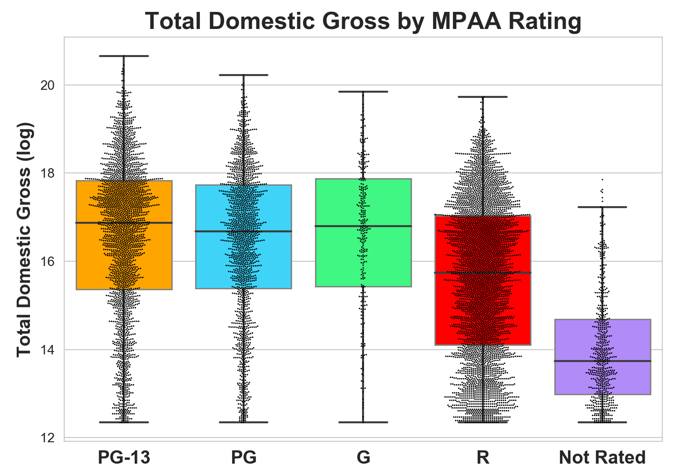
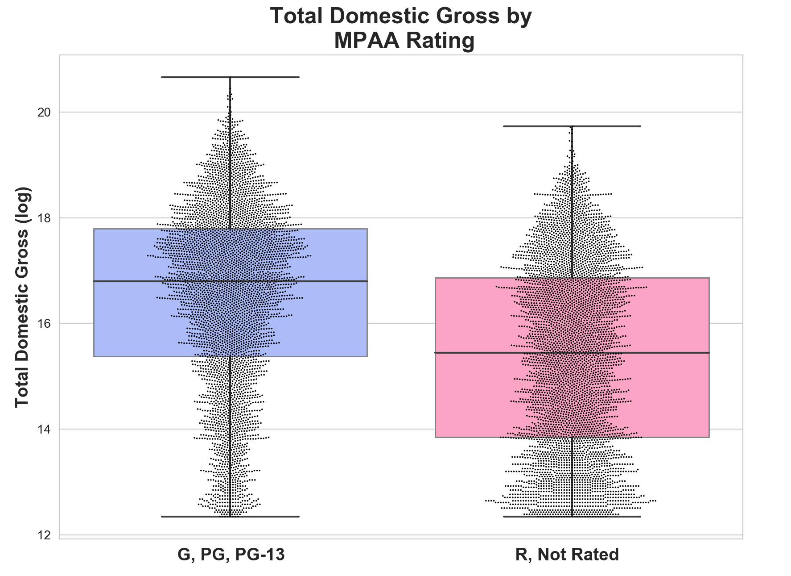
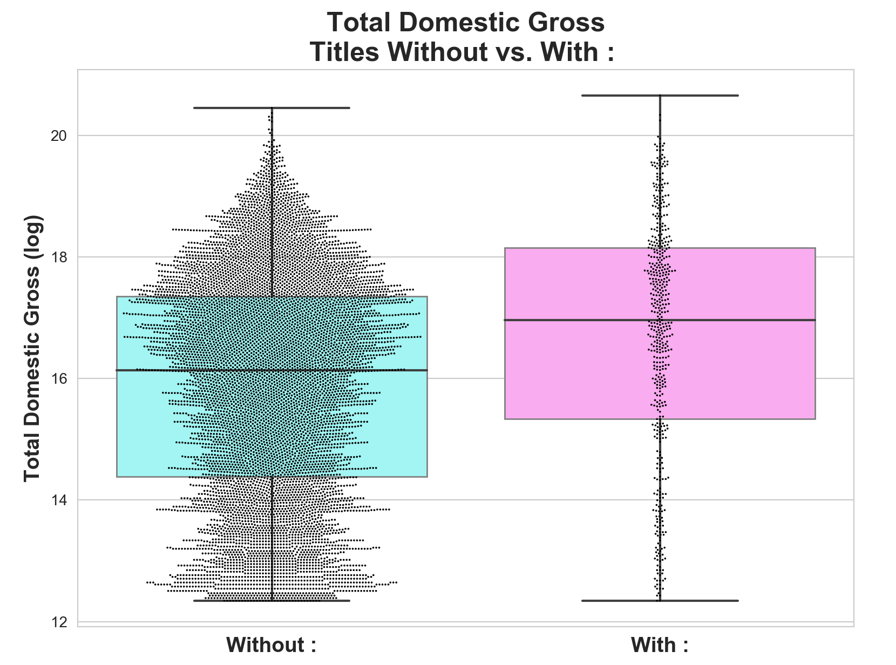

**For this project I scraped the top 10,000 grossing films from IMDb using BeautifulSoup and Python.
Using Pandas and regular expressions, along with other tools, I cleaned the data thoroughly and did some feature engineering.**

**My main goal was to build a model to predict total domestic gross only using information that could be known before a movie is released in theaters.**

**I discovered that a director's mean gross of previous films was a strong positive predictor of box office success. Additionally,  runtime positively predicted box office gross as did a G, PG, or PG-13 rating (as compared to an R rating or being Not Rated). Other positive predictors of box office gross were number of films a director had in the top 10,000 and having a colon in the title.**\

**Here you can see the relationship between MPAA rating and domestic gross. (9,136 movies total)**
  
  
  

**Instead of creating dummy variables for the ratings, I combined G/PG/PG-13 into one category and R/Not Rated into another, creating a binary variable. While this simplified the analyses, in the future it could be fruitful to investigate the ratings independently as well for possible interactions with other variables. (9,136 movies)**
  
 
  
Actual dollars: P/PG/PG-13 Median = 19.7 Million,     R/Not Rated Median = 5.1 Million

  
  

**On average, movies containing a colon in the title earned significantly more than movies without a colon. Also note that most movies (94%) do not have a colon in the title. (9,136 movies)**
  
 
  
Actual dollars: Without ':' Median = 10.2 Million,     With ':' Median = 23.2 Million
